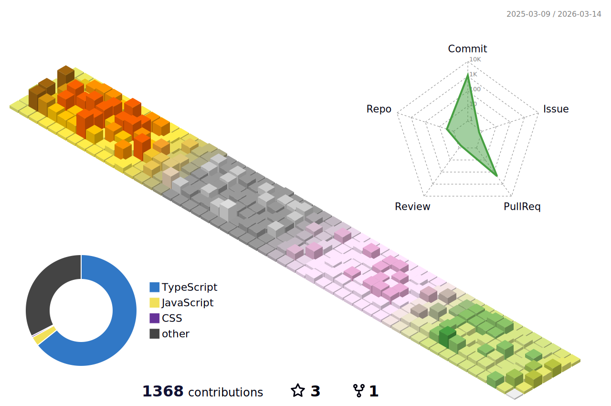

### 안녕하세요. 사용자 경험과 구조의 균형을 끊임없이 고민하는 프론트엔드 개발자 이병윤입니다.

- 연락처 : 010 5024 1910
- 이메일 : bur5698@naver.com

## :hammer: Technology Stacks

- Frontend : 

  
  
  
  

- Backend :

  
  
  
  
  
  
  

- Communication :

  
  
  
  
  
  

---

### 🪞 Retrospective
[2025-11-12]
- Handler로 구조를 만들때 index에 area의 큰 틀을 두고 작업을 하면 편한것 같다.

[2025-11-04]
- Action / Handler 중심 구조에서 Area 중심 구조로 설계 감각이 확장되었다.
- Area 단위로 구역을 나누고, 그 안에 `_action`, `_handler`를 두어 UI 구조와 폴더 구조를 일치시켰다.
- 반복되는 설계 패턴을 Template으로 두었는데, 한 눈에 어디서 쓰는지 잘 보이지 않아서 `@owner`, `@usedBy`, `@purpose` 주석을 남겨 문맥을 보존하기로 했다.

[2025-11-03]
- store의 setter 반복을 자동화할 수 있을 것 같다.
- 다만, 자동화는 타입 안전성과 명시성을 해칠 수 있으니, slice 단위로 한정하자

[2025-10-31]
- 폴더 구조가 깊어질수록 import도 깊어져 어디서 파생된 것인지 확 알기가 어려웠다
- 핵심 폴더마자 index.ts를 두어 경로를 단축시키자

---

