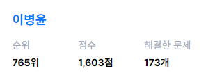

    
# Byoungyoon ✌🤞🤞

### 경력

- [2016.03-2021.02] 울산과학대학교 컴퓨터정보학부
- [2020.08-2021.02] 구디아카데미 29기 (금융 오픈플랫폼(자바)기반 핀테크 개발자 양성과정)
  - Spring Boot, Mybatis, Python, Node.js 학습
  - JavaScript, Java 학습
  - 프로젝트
    - LMS (학습시스템)
      - [Source Code](https://github.com/rigizer/LMS-X)
      - Spring Boot(back), JSP(front) 사용
      - MariaDB, Mybatis를 사용하여 DB 연동
      - AWS Lightsail에서 Tomcat 구동 후 베포 테스트
    - 가계부
      - [Source Code](https://github.com/byoungyoon/cash)
- [2021.02~2023.07] (주)제이비티 개발본부
  - 공간데이터를 활용한 신규개발, 유지/보수
    - Spring Boot
  - 프로젝트
    - POI (3개월 교육 프로젝트)
        - POI 데이터를 활용하여 지도 만들기
        - [Source Code](https://github.com/byoungyoon/poi.git)
    - 사내 IoT플랫폼 솔루션 ThingsBoard 제품화 프로젝트
        - Angular, Spring boot, postgreSQL, Cassandra
        - 중간 관리자 권한을 추가하고 *ngIf, fxshow를 이용하여 적용 / 사진 관련 액션을 angular에 추가하고 api 개발 / dashboard 스타일링 / dashboard에 다이어로그 액션 추가
    - 강원도 급경사지 상시계측관리 체계구축을 위한 시스템 구축
        - React, Spring boot, postgreSQL, Cassandra
        - 테이블,  dialog 의 공통 컴포넌트 제작  / 관리자 페이지 ui, ux / 오픈라이브러리 ol 이용하여 지도 정보 구현
    - 웹 서비스향 사내 그룹웨어 개발
        - jQuery, Spring boot, postgreSQL
        - 무작위 join을 사용한 쿼리문을 서브쿼리를 이용하여 최적화 / 프로젝트, 복리비, 지출결의 대한 웹 페이지 ui 제작 및 CRUD 
    - THREE.JS 를 활용한 플랫폼 개발
        - react, typescript, webpack, three.js, 
        - three.js를 활용한 입체모형 제작, tree 계층구조에 따른 3d 모형제작  
        - raycaster를 활용한 마우스 컨트롤 등

---

### 사이드 프로젝트

- [2023.11.03 ~ ing] 모두의 농구장  

  - react, typescript, webpack, storybook 사용
  - 비사이드 홈페이지에서 포텐데이 311기로 참가해서 만든 프로젝트 (FE 참가)
  - ~11.12 까지 1차 완성작업, 2차 작업으로 앱 반응형 및 관리자 페이지 추가 예정
  - https://bside.best/projects/detail/P231101145224

---

### Once I've Used 👍

---

### 알고리즘 🎭

백준

프로그래머스

