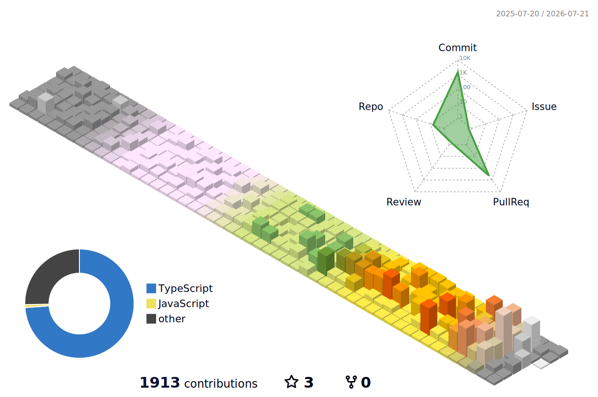

# Hi there! I'm Byoungyoon 👋

> **"Vibe Coding을 지양하고, 시스템과 아키텍처로 증명하는 5년 차 프론트엔드 엔지니어"**

복잡한 비즈니스 로직을 다루며, 감각에 의존하는 개발보다는 **예측 가능하고 확장성 있는 구조**를 고민합니다.
특히 직접 커스텀한 **Area/Action/Handler 패턴** 등을 활용하여 프론트엔드 생태계 내에서 백엔드와의 경계를 효율적으로 허물고, 글로벌 스탠다드에 부합하는 단단한 아키텍처를 설계하는 것을 목표로 합니다.

 

## 🎯 What I'm Focusing On
최근에는 실무에서의 아키텍처 고도화와 더불어, 사용자 경험(UX)을 극대화하면서도 오버엔지니어링을 피하는 경량화된 프로덕트 개발에 집중하고 있습니다.

- 🏢 **Enterprise Team System (Work):** 사내 협업 및 업무 효율화를 위한 팀 시스템 구축. Area/Action/Handler 패턴을 도입해 복잡한 비즈니스 로직을 체계적으로 분리하고, 팀 내 프론트엔드 코드 표준화 및 UI 컴포넌트 재사용성을 극대화하는 데 주력했습니다.
- 🔗 **Side Project '쏙' - Link Archiving Service:** 직관적이고 빠른 링크 저장 및 관리 서비스 개발. 불필요한 복잡도를 덜어낸 경량화된 아키텍처를 기반으로 쾌적한 사용자 경험을 제공하며, 렌더링 최적화와 안정적인 데이터 동기화를 직접 실험하고 검증한 프로덕트입니다.

 

## 🛠️ Tech Stack & Architecture

### 🌐 Main Expertise (React Ecosystem)
**"타입 안정성(Type-Safety)과 제로 런타임 CSS, 최신 렌더링 최적화 기술을 적극 활용합니다."**

  
  
  
  
  
  

### 📱 Cross-Platform
**"웹을 넘어 모바일 네이티브 환경까지 고려한 유연한 크로스플랫폼 대응 능력을 갖추고 있습니다."**

  
  

### ⚙️ Backend & Data Modeling
**"단순한 API 연동을 넘어, Node.js와 Java 생태계에 대한 이해를 바탕으로 효율적인 데이터 모델링을 설계합니다."**

  
  
  
  

 

  

 

## 📫 Contact

편하게 연락 주세요! ☕️

- 📧 **Email:** bur5698@gmail.com
- 📞 **Phone:** 010-5024-1910
