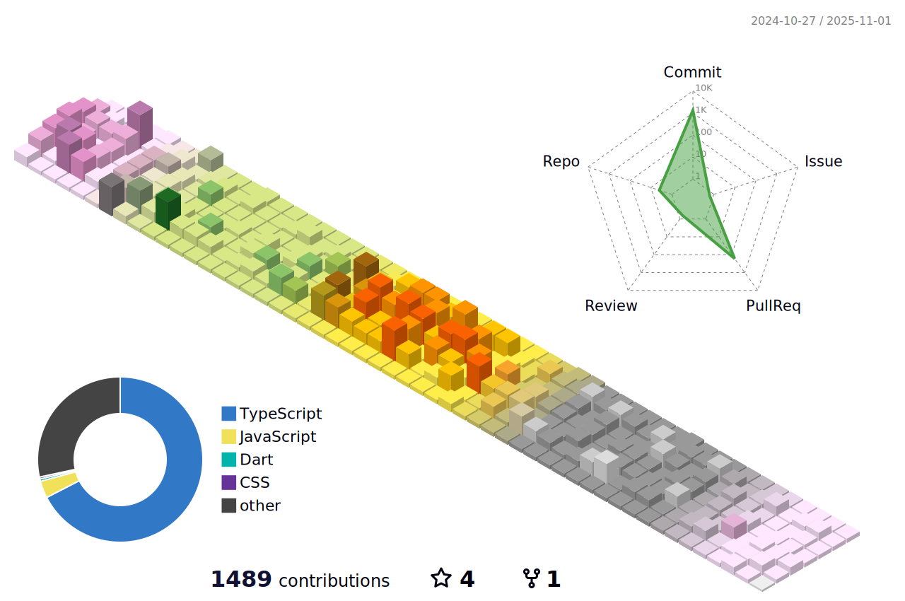

### 안녕하세요. 더 좋은 코드에 대해 고민하고 만들고 싶은 웹 개발자 이병윤입니다.

- 연락처 : 010 5024 1910
- 이메일 : bur5698@naver.com
- 기술 블로그 : https://velog.io/@byoungyoon/posts
- 알고리즘, 프로젝트 리뷰 블로그 : https://blog.naver.com/bur5698

## :hammer: Technology Stacks

- Frontend : 
  
  
  
  
  
  
  
  
  
  
  
  

- Backend : 
  

- Mobile App :  

- Deployment : 
  

- Version Control : 
  
  

- Communication : 
  
  

---

